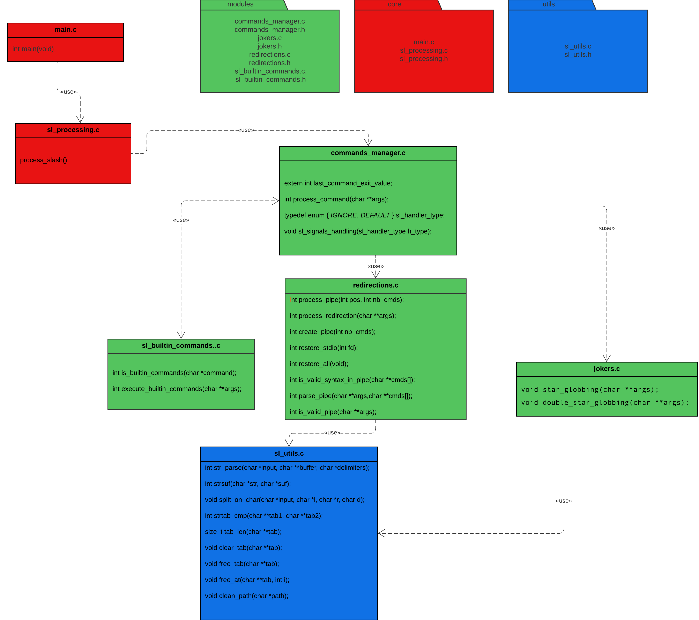

## Sommaire

- [Architecture](#architecture)
- [Structure et Algorithmes](#structures-et-algorithmes)
  - [Parser](#parser) 
  - [Commandes Internes](#commandes-internes)
  - [Commandes Externes](#commandes-externes)
  - [Jokers](#jokers)
  - [Redirections](#redirections)
  - [Gestion de signaux](#gestion-de-signaux)

## Architecture

Voici le diagramme architecturale




## Structure et Algorithmes


### Parser

Concernant le parser, la stratégie est la suivante :
nous avons décidé de mettre tous les jetons entrés dans la ligne de commandes dans un tableau de `char *` alloué

```c
static char *user_args[MAX_ARGS_NUMBER] = { 0 };
```

Le délimiteur entre deux jetons est un espace
Une fois que le tableau a été remplie, les autres cases sont mises à `NULL`

### Commandes Internes

Nous utilisons des tableaux de ```char *``` et de pointeurs de fonctions

```c
static const char *str_builtin_cmd[] = {
    "cd", "pwd", "exit", "history", "type"
};

static int (*builtin_cmd[])(char *args[]) = {
    sl_cd, sl_pwd, sl_exit, sl_history, sl_type
};
```

Ces structures de données nous facilitent la tâche lors de la transition `ligne de commandes` et exécutions.
En effet ,il suffit alors de regarder si `user_args[0]` est un élément de `str_builtin_cmd`.
Une fois qu'on a vérifié cette condition ,on appelle alors la fonction correspondante avec `user args` en argument.

### Commandes Externes

Dans le cas où la condition du haut n'est pas vérifiée, il s'agit d'une commande externe.
La fonction `execute_external_command` créera un processus fils qui exécutera la commande en s'assurant aussi, d'avoir réinitialisé les signaux à défaut pour le processus fils.

### Jokers

#### Étoile
Pour l'expansion de l'étoile simple en tant que préfix on procède de la manière suivante:

1. On expand étoile sur chaque arguments de la ligne commande indépendamment des autres.

```c
static int process_one(char *path, char *buf[])
{
    //...
    char str_dir[MAX_ARGS_STRLEN] = { 0 };
    char suffix[MAX_ARGS_STRLEN] = { 0 };
    char end[MAX_ARGS_STRLEN] = { 0 };
    //...
}
```

2. Suite à cela on sépare notre argument en 3 sous chaines qui correspondent aux **répertoire à ouvrir** `str_dir`, le **suffix** `suffix` pour vérifier si une entrée correspond bien avec ce qu'on recherche, et enfin la **suite de la chaine** `end`.

```c
static int get_entries_matches(...)
{
    //...
    while ((entry = readdir(dir))) {
        //...
        buf[i] = build_string(str_dir, entry->d_name, end);
        //...
    }
    //...
}
```

3. Si une entrée correspond à ce que l'on cherche on construit une chaine qui correspond à la concaténation des variables `str_dir`, `entry->d_name` et `end`. Et que l'on rajoute à un tableau temporaire.

4. Ainsi, si le tableau rempli, contient des éléments on ré-itère le processus avec tous les éléments du tableau jusqu'à ce que le processu ne change rien au tableau des arguments. Si celui-ci rend un tableau vide on ne touche pas à l'argument courent.

5. Enfin, on rajoute tout ce qui a été trouvé (si c'est le cas, sinon on ne change rien) dans notre tableau d'arguments final `user_args` et on passe à l'argument suivant.

### Double étoile

Pour l'expansion de la double étoile, on utilise l'expansion de l'étoile simple en respectant un suffixe donnée dans l'argument :

1. On lance la recherche avec process_ds en donnant trois arguments : le chemin actualisé de la recherche, le suffixe et un buffer pour stocker les résultats de l'expansion d'étoile
```c
*dir_to_open = '.';
strcpy(glob_star, !strcmp(args[i], "**/") ? "*/" :
                    !strcmp(args[i], "**") ? "*" : args[i] + 3);
int res = process_star_star(dir_to_open, glob_star, buf);
```
 
2. On ouvre le répertoire donné en paramètre et on étend l'étoile simple à partir du chemin et du suffixe, si des résultats sont trouvés, on stock dans buff.
```c
 if (*dir_to_open != '.')
    strcat(strcat(path, dir_to_open), "/");

strcat(path, glob_star);
star_g[0] = strdup(path);

if (!(dir = opendir(dir_to_open))) {
    perror("opendir");
    match_count = -1;
    goto error;
}
star_globbing(star_g);
if (strcmp(star_g[0], path)) {
    match_count += tab_len(star_g);
    insert_at(buf, star_g, tab_len(buf));
```

3. Par la suite on concatène le chemin actuel et le nom du répertoire que l'on a ouvert, en créant simultanément une strucutre lstat pour vérifier que l'entrée lue par readdir n'est pas un lien symbolique.
```c
strcat(new_path, entry->d_name);
if (lstat(new_path, &st) == -1) {
    perror("lstat");
    match_count = -1;
    goto error;
}
```

4. Enfin on lance la recherche récursivement sur les entrées de l'arborescence.

```c
int res = process_star_star(new_path, glob_star, buf);
if (res < 0) {
    printf("process_star_star\n");
    match_count = -1;
    goto error;
}
match_count += res;
```

### Redirections

```c
static int std_fds_cpy[3] = { 0 };
static int fdpipe[][2] = { 0 };

static const char *str_redirections[REDIRECTION_NUMBER] = {
    "<",
    ">", ">|", ">>",
    "2>", "2>|", "2>>"
};

struct redirection
{
    const char *name;
    int flags;
    int fd;
};

static void set_redirection_data(int r_number, struct redirection *rd)
{
    int fd = (r_number + 2) / 3;
    int type = (r_number + 2) % 3;
    int flags = 0;

    if (r_number == 0) {
        flags = O_RDONLY;
    } else {
        flags = O_WRONLY | O_CREAT;
        flags |= type == 0 ? O_EXCL : type == 1 ? O_TRUNC : O_APPEND;
    }
    rd->name = str_redirections[r_number];
    rd->flags = flags;
    rd->fd = fd;
}
```

Le tableau `std_fds_cpy` stocke les sauvegardes des descripteurs `STDIN` ,`STDOUT` et `STDERR` .\
Le tableau `fdpipe` stocke les lectures et écritures de chaque pipe.`Il sera rempli après avoir reparsé user_args par '|'`.\
Le tableau `str_redirections` stocke le type des redirections , (Nous gardons la même stratégie que pour les commandes internes) .\
La `struct redirection` nous permet de stocker le nom de la redirection, ses flags d'ouverture, et le descripteur associé. Et la remplit via la fonction `set_redirection_data`

### Gestion de signaux

```c
typedef enum { IGNORE, DEFAULT } sl_handler_type;

void sl_signals_handling(sl_handler_type h_type)
{
    struct sigaction sa = { 0 };
    sa.sa_flags = SA_RESTART;
    sigemptyset(&sa.sa_mask);
    sa.sa_handler = (int)h_type == 0 ? SIG_IGN : SIG_DFL;

    if (sigaction(SIGTERM, &sa, NULL) == -1)
        goto error;
    if (sigaction(SIGINT, &sa, NULL) == -1)
        goto error;

    return;
error:
    perror("sigaction");
    exit(EXIT_FAILURE);
}
```

Pour les signaux, nous avons créer une fonction qui change l'handler, selon si on souhaite ignorer ou garder le comportement par défaut des signaux, grâce à une enum.
